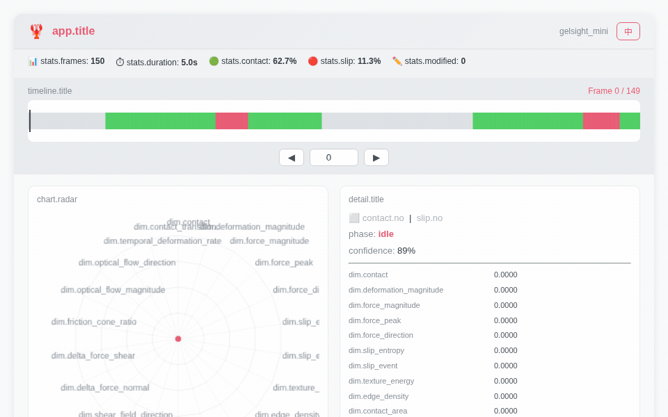

# TouchLabel AI 🦞

<h3 align="center">传感器无关的触觉数据标注工具</h3>
<p align="center"><strong>load → review → export · 三步闭环</strong></p>

<p align="center">
  <a href="https://pypi.org/project/tlabel/"></a>
  <a href="https://pypi.org/project/tlabel/"></a>
  <a href="https://github.com/liesliy/tlabel/blob/main/LICENSE"></a>
  <a href="https://github.com/liesliy/tlabel/stargazers"></a>
  <a href="https://pepy.tech/projects/tlabel"></a>
  <a href="README.md">English</a>
</p>



---

## 🚀 快速上手

```bash
pip install tlabel
```

```python
import tlabel

# 1️⃣ 加载 — 自动识别传感器格式
data = tlabel.load("gelsight_force.pkl")     # GelSight / DIGIT
data = tlabel.load("paxini_episode.h5")      # PaXini
data = tlabel.load("daimon_data/")           # 戴盟（目录或 .parquet）

# 2️⃣ 标注 — Jupyter 交互面板
data.review()          # 中文界面
data.review(lang="en") # 英文界面

# 3️⃣ 导出
data.export("output.json")   # TLabel Format v2 JSON
data.export("output.csv")    # CSV 平面表
```

<details>
<summary>📥 用演示数据试试</summary>

```bash
pip install tlabel
python -c "
import json, urllib.request
from tlabel.core.types import TLabelFrame, TLabelData

url = 'https://raw.githubusercontent.com/liesliy/tlabel/main/examples/data/demo_gelsight.json'
raw = json.loads(urllib.request.urlopen(url).read())
frames = [TLabelFrame(f['frame_idx'], f['timestamp_s'], f['tlabel_v2'], f.get('manipulation_phase','idle'), f.get('confidence',1.0)) for f in raw['frames']]
data = TLabelData(frames, raw['sensor'], raw['episode'], raw['capabilities'])
data.review()
"
```

</details>

---

## 📡 支持的传感器

| 传感器 | 格式 | 维度数 | 光流 | 状态 |
|--------|------|:------:|:----:|:----:|
| **GelSight Mini** | `.pkl` | 22 | ✅ | ✅ 稳定 |
| **DIGIT** | `.pkl` | 22 | ✅ | ✅ 稳定 |
| **戴盟 DM-TacClaw** | `.parquet` / 目录 | 22（有视频）/ 20（无视频） | ✅ / — | ✅ 稳定 |
| **帕西尼 PXCap** | `.h5` / `.hdf5` | 20 | — | ✅ 稳定 |

> 力觉型传感器（帕西尼）无光学图像，不支持光流特征，输出 20 维；图像型传感器输出全量 22 维。戴盟在无视频文件时自动降级为 20 维。

---

## 📦 安装

```bash
# 最小安装（仅 numpy）
pip install tlabel

# 按传感器装可选依赖
pip install tlabel[gelsight]   # GelSight / DIGIT → opencv-python
pip install tlabel[paxini]     # 帕西尼 → h5py
pip install tlabel[daimon]     # 戴盟 → pyarrow + opencv-python

# 一步到位
pip install tlabel[all]
```

---

## 🎨 面板功能

- 🎨 **彩色时间轴**：绿=接触 · 红=滑移 · 灰=无接触
- 🕸 **22维雷达图**：TLabel Format v2 全维度可视化，中英文标注
- ✏️ **帧修正与批量修改**：选中区间一键修改
- 🔗 **联动规则**：`contact=0` 时自动归零 7 个关联字段 + `manipulation_phase→idle`
- 🌐 **中英文切换**：面板右上角一键切换
- 📤 **导出**：JSON / CSV，后缀自动判断格式

---

## TLabel Format v2 — 22 维特征

### 静态特征（18 维）

| # | 字段 | 说明 |
|---|------|------|
| 1 | `contact` | 接触状态标志 |
| 2 | `deformation_magnitude` | 表面形变强度 |
| 3 | `force_magnitude` | 法向力幅度 |
| 4 | `force_peak` | 滑动窗口内力峰值 |
| 5 | `force_direction` | 力矢量方向角（°） |
| 6 | `slip_entropy` | 滑移检测不确定性 |
| 7 | `slip_event` | 滑移事件标志 |
| 8 | `texture_energy` | 表面纹理频率能量 |
| 9 | `edge_density` | 接触边缘像素占比 |
| 10 | `contact_area` | 接触区域面积占比 |
| 11 | `centroid_x` | 接触质心 X 坐标 |
| 12 | `normal_field_magnitude` | 法向压力场幅度 |
| 13 | `normal_field_variance` | 法向场空间方差 |
| 14 | `shear_field_magnitude` | 剪切应力幅度 |
| 15 | `shear_field_direction` | 剪切方向角（°） |
| 16 | `delta_force_normal` | 帧间法向力变化量 |
| 17 | `delta_force_shear` | 帧间剪切力变化量 |
| 18 | `friction_cone_ratio` | 切向力/法向力比值 |

### 时序特征（4 维，v0.2.0 新增）

| # | 字段 | 图像型 | 力觉型 | 说明 |
|---|------|:------:|:------:|------|
| 19 | `optical_flow_magnitude` | ✅ | — | 帧间运动幅度（Farneback 光流） |
| 20 | `optical_flow_direction` | ✅ | — | 光流方向角（°） |
| 21 | `temporal_deformation_rate` | ✅ | ✅ | 形变速率 |
| 22 | `contact_transition` | ✅ | ✅ | 接触状态转换概率 |

---

## 📖 API 速查

```python
import tlabel

# ── 加载 ──
data = tlabel.load(path)                     # 自动识别传感器格式
data = tlabel.load(path, format="gelsight")  # 手动指定适配器

# ── 属性 ──
data.num_frames        # int — 总帧数
data.duration_s        # float — 时长（秒）
data.sensor_type       # str — 传感器标识
data.dimension_keys    # list — 当前传感器所有维度键名
data.modified_count    # int — 已手动修正帧数

# ── 帧访问 ──
frame = data[0]                          # 按索引访问
frame = data.get_frame(42)               # 按 frame_idx 访问
frame.contact                            # 接触值
frame.slip_event                         # 滑移事件值
frame.is_modified                        # 是否已修正

# ── 修正 ──
frame.patch("contact", 0)                         # 单帧修正（默认联动）
frame.patch("contact", 0, cascade=False)           # 不联动
data.batch_patch(10, 50, "contact", 0)             # 区间批量修正

# ── 查看与导出 ──
data.review()                    # Jupyter 面板（中文）
data.review(lang="en")           # 英文
data.export("output.json")       # JSON（TLabel Format v2）
data.export("output.csv")        # CSV
```

### 联动规则（contact → 0）

当 `contact` 设为 `0` 时，以下字段自动归零：

| 自动归零字段 | 条件 |
|-------------|------|
| `force_magnitude` | 始终 |
| `force_peak` | 始终 |
| `slip_event` | 始终 |
| `delta_force_normal` | 始终 |
| `delta_force_shear` | 始终 |
| `contact_area` | 始终 |
| `contact_transition` | 仅当值 > 0.5 |
| `manipulation_phase` | → `"idle"`（若非 idle） |

---

## 🗂 项目结构

```
tlabel/
├── core/
│   ├── types.py          # TLabelFrame / TLabelData 数据容器
│   ├── loader.py         # 自动识别与分发加载
│   └── registry.py       # 适配器注册表
├── adapters/
│   ├── base.py           # BaseAdapter 接口
│   ├── gelsight.py       # GelSight Mini / DIGIT
│   ├── paxini.py         # 帕西尼 PXCap
│   └── daimon.py         # 戴盟 DM-TacClaw（含视频解码）
├── viewer/
│   ├── panel.py          # Jupyter _repr_html_ 渲染器
│   └── templates.py      # HTML + JS + CSS 模板引擎
└── export/
    └── writer.py         # JSON / CSV 导出 + NumpyEncoder
```

---

## 🤝 参与贡献

欢迎贡献！详见 [CONTRIBUTING.md](CONTRIBUTING.md)。

**适合新手的 Issue：**
- 🔌 添加新传感器适配器（如 SynTouch、XELA）
- 📊 改进雷达图 UI（深色模式、悬停交互）
- 🌐 增加更多语言支持（日本語、한국어）
- 🧪 补充边界情况的集成测试

---

## 📄 许可证

[MIT](LICENSE) © 牛宿科技

---

<p align="center">
  <strong>觉得有用？给我们加个星 ⭐</strong>
</p>
