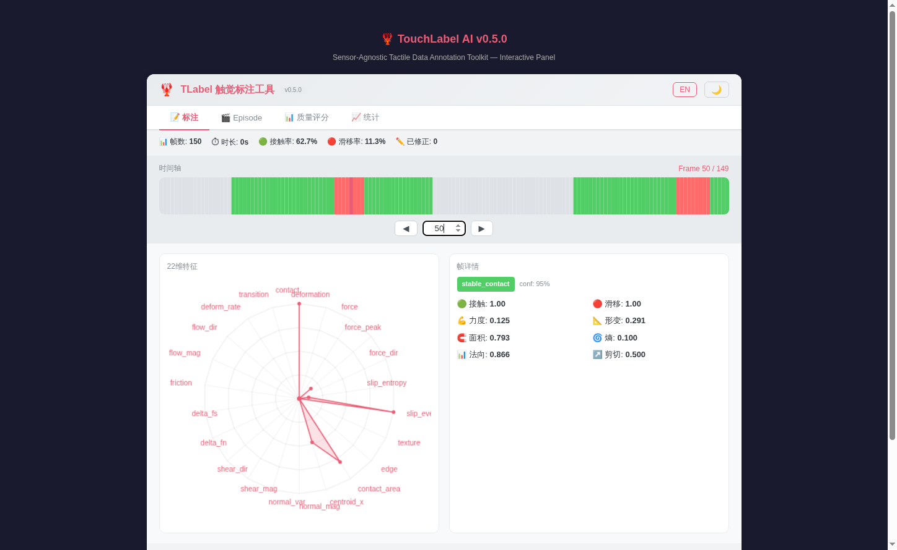

<div align="center">

# 🦞 TouchLabel AI

### **全球首个传感器无关的触觉数据标注工具**

**加载任意触觉传感器 → 可视化标注 → 导出统一标准**

[](https://pypi.org/project/tlabel/)
[](https://pypi.org/project/tlabel/)
[](https://github.com/liesliy/tlabel/blob/main/LICENSE)
[](https://pepy.tech/projects/tlabel)
[](https://github.com/liesliy/tlabel/stargazers)
[](https://github.com/liesliy/tlabel/commits/main)
[](README.md)



**GelSight · DIGIT · 帕西尼 · 戴盟 — 一个工具，一种格式，全部传感器**

[🚀 快速上手](#-快速上手) · [🤖 AI预标注](#-ai预标注) · [📊 基准测试](#-基准测试) · [📖 文档](#-支持的传感器) · [🤝 贡献](#-贡献)

</div>

---

## 🆕 更新亮点

### v0.16.0 — 开放平台架构 + 社区贡献体系 🆕
**TLabel 正式成为开放平台——任何人都可以为它添加传感器支持。**
- 🏗️ **双基类架构**：`DataAdapterBase`（数据集加载器）与 `SensorAdapterBase`（实时传感器）清晰分离，贡献者只需实现 3 个方法
- 🔌 **外部适配器注册**：`register_external_adapter()` API + Python `entry_points` 自动发现——第三方包无需修改 TLabel 源码即可接入
- 🛠️ **CLI 命令行工具**：`tlabel validate/list/info/version`——校验数据文件、查看已注册适配器、检查兼容性
- 📦 **社区贡献工具包**：完整的适配器模板（`contrib/adapter-template/`）、PR 模板、详细指南见 [CONTRIBUTING.md](CONTRIBUTING.md)
- 🧩 **适配器数量**：9 个内置适配器 + 通过 entry_points 支持无限社区适配器
- 📖 **开放文档**：CONTRIBUTING.md、适配器开发指南、架构全景——构建和提交新适配器所需的一切

```bash
# 安装并体验 CLI
pip install tlabel==0.16.0
tlabel list          # 查看所有已注册适配器
tlabel validate data.json  # 校验 tlabel_v2 schema 兼容性
tlabel info paxini_gen3    # 查看适配器详情
```

### v0.15.0 — 适配器架构重构 + PaXini GEN3 实时 SDK
**插件化适配器系统，支持实时触觉数据采集。**
- 🔌 **表驱动注册**：新增适配器仅需改 1 行代码（原需 5 个文件）
- 🏷️ **标准化命名**：`品牌_型号` 规范（如 `paxini_gen3`、`daimon_dm_tac`）
- ⚡ **PaXini GEN3 实时适配器**：完整 SDK 集成，22 维特征提取
  - 压力归一化（0-600kPa → 0-1）、滑移检测（质心偏移 + 力变化率）
  - 自动布局检测：gen3_1/gen3_2/gen3_5 配置
  - 从 contact_mask + pressure_map 生成伪触觉图像
- 🔄 **文件重组织**：`paxini.py` → `paxini_dataset.py`，`daimon.py` → `daimon_dataset.py`
- ✅ **12 个适配器注册**（11 个可用 + 1 个占位）：GelSight、PaXini（数据集 + GEN3 + PX6D）、Daimon（数据集 + DM-Tac）、ToucHD、UniVTAC、VTouch、YCB-Slide、TacQuad、TLabel
- 🔒 **100% 向后兼容**：所有现有 `tlabel.load()` 调用无需修改

### v0.14.0 — Taxonomy 系统 & 力推断 Primitive 预标注 🆕
**从视触觉图像到力推断到 Primitive 标注 — 全自动工作流。**
- 🧬 **Taxonomy 系统**：可配置的 primitive 分类体系，内置 7 种物理含义明确的默认子集（reach/grasp/press/squeeze/wrap/wipe/lift），源自 T-Rex 22 种，含 Cutkosky 抓握子分类（力量/精确/侧向抓握）
- 💪 **力推断→Primitive 流水线**：无需力传感器，从视触觉图像（GelSight/DIGIT）自动推断力分布→检测事件→标注 primitive
- 🎯 **置信度与来源追踪**：每条 AI 预测都携带 `source`（ai_predicted / ai_predicted_estimated）+ `confidence` 分数——来源透明可追溯
- 🔧 **自定义 Primitive 注册**：`register_custom_primitive()` API，支持用户定义新 primitive 类型及其物理规则
- 📊 **增强 CSV 导出**：新增 `primitive_source` 和 `primitive_confidence` 列，完整元数据可追溯
- 🎨 **可折叠预标注面板**：Panel 内 taxonomy 选择器 + 预标注按钮 + 结果统计
- 📦 **批量修正支持**：批量 primitive 修正，支持类型选择 + 置信度控制

```python
import tlabel

# 加载数据并自动预标注 primitive（使用默认 taxonomy）
data = tlabel.demo('gelsight')
data.predict_primitives()  # 从力/接触模式自动推断

# 使用自定义 taxonomy 并设置最低置信度
taxonomy = tlabel.get_default_taxonomy()
taxonomy.register(tlabel.PrimitiveRule(
    name='poke', min_force=0.1, max_deformation=0.15,
    contact_required=True, min_confidence=0.5
))
data.predict_primitives(taxonomy=taxonomy, min_confidence=0.4)

# 全局注册自定义 primitive
tlabel.register_custom_primitive('poke',
    force_range=(0.1, 0.8), deformation_max=0.15,
    contact_required=True, confidence=0.5)

# 导出完整元数据（source + confidence）
data.export("output.csv")  # 包含 primitive_source、primitive_confidence 列
```

### v0.13.0 — Motor Primitive 标注系统
**全球首个触觉 Primitive 标注工具——灵感来自 T-Rex（李飞飞、Jim Fan、徐丹飞等）。**
- 🏷️ **22 个 Motor Primitives**：wrap、lift、grasp、fold、cut、insert、press、wipe、peel、assemble、extract、twist、shake、dispense、disassemble、squeeze、pour、open、close、screw、unscrew、reach
- 📊 **Primitive 时间轴轨道**：Panel 中 Canvas 渲染的彩色 primitive 段落，帧级详情标记
- 🤖 **AI 预标注**：`predict_primitives()` — 基于力/接触模式的启发式推断（力上升→grasp/press，稳定+运动→wrap/wipe，下降→squeeze，无接触→reach）
- 📈 **结构化标注**：`add_primitive(name, start_frame, end_frame)` API，支持时间区间标注
- 💾 **导出支持**：CSV 导出新增 `primitive_label` 列；JSON 导出新增 `primitive_annotations` 数组
- 🔄 **向后兼容**：旧 tlabel.json 文件正常加载（无 primitive_annotations → 空列表）

```python
import tlabel

# 加载带 primitive 标注的 demo
data = tlabel.demo('primitives_demo')
data.review()  # 在 Panel 中查看 primitive 时间轴轨道

# 手动添加 primitive 标注
data.add_primitive('reach', start_frame=0, end_frame=10)
data.add_primitive('grasp', start_frame=10, end_frame=25)
data.add_primitive('lift', start_frame=25, end_frame=40)

# AI 预标注（启发式规则）
data.apply_primitives()  # 从力/接触模式自动推断 primitive

# 获取 primitive 时间线
timeline = data.get_primitive_timeline()
# [('reach', 0, 10), ('grasp', 10, 25), ('lift', 25, 40)]
```

### v0.12.0 — 触觉图像可视化 & 数据增强
**Canvas 渲染的触觉图像回放、纯 numpy 数据增强、AnyTouch 多传感器支持。**
- 🎬 **触觉图像序列可视化**：Canvas 渲染播放，三级策略（实拍图像 / 热力图 / 占位），播放/暂停/拖动/变速控制，暗色模式 & 国际化
- 📈 **数据增强模块**：5 种方法（`time_warp`、`noise_inject`、`random_crop`、`force_scale`、`frame_dropout`），零新依赖（纯 numpy），三级 API
- 🔌 **TacQuad 适配器**：GeWu-Lab AnyTouch (ICLR 2025) — GelSight Mini、DIGIT、DuraGel + 可选 Tac3D 力场
- 📦 `pip install tlabel[tacquad]`

```python
import tlabel

# 数据增强 — 一行搞定
data = tlabel.demo('gelsight')
augmented = tlabel.augment(data, methods=["time_warp", "noise_inject"], seed=42)

# TacQuad 多传感器加载
data = tlabel.load("anytouch_dataset/", format="tacquad", sensor="digit")
```

### v0.10.2 — UniVTAC 适配器
**跨数据集触觉互操作 — UniVTAC 基准测试支持。**
- 🆕 **UniVTAC 适配器**：加载 UniVTAC HDF5 数据集，自动识别（双 GelSight Mini，22 维）
- 🔍 **智能 HDF5 检测**：自动区分 PaXini 与 UniVTAC
- 📦 `pip install tlabel[univtac]`

### v0.8.0 — FTP-1 / MTTS 导出
**标注数据一键导出为 FTP-1 的 MTTS Zarr 格式，直接用于触觉基础模型微调。**
- 🚀 **FTP-1 转换器**：`tlabel_to_ftp1()` / `batch_to_ftp1()`，一行代码导出 Zarr
- 🖐 **21 个功能区**：MTTS 形态感知触觉令牌空间（15 个手部区域 + 6 个腕部力矩通道）
- 📡 **7 种传感器注册**：GelSight、GelSightMini、FreeTacMan、ViTaMIn、3DViTac、Contactile、BinaryContact
- 🎨 **面板新增导出 Tab**：传感器选择、功能区可视化勾选、预设按钮、导出预览
- 📦 **Zarr 后端**：追加模式支持多 Episode 数据集，自动图像缩放 224×224 + 归一化

```python
from tlabel import demo
data = demo('gelsight')
data.export_ftp1("output.zarr",
    sensor_name="GelSightMini",
    functional_areas=[0, 1])  # 拇指尖 + 食指尖
```

### v0.5.0 — AI辅助预标注
**让引擎帮你建议标签，你来审核修正——人在回路，不是黑箱。**
- 🤖 **PredictEngine**：自动预测接触、滑移和操作阶段
- 📈 **热启动 `fit()`**：从你已有的部分标注数据学习——即使只标了10%也能显著提升准确率
- 🎯 **置信度阈值**：只应用高于阈值的预测，始终由你掌控
- 🔬 **HMM阶段检测**：隐马尔可夫模型 + Viterbi解码推断操作阶段
- 🧹 **移除黑盒pkl模型**：不再有不透明的预训练权重——每个预测都可解释

<details>
<summary><b>历史版本</b></summary>

- **v0.13.1** — GBK 编码热修复，Primitive 系统稳定化
- **v0.12.4** — 修复 gelsight_images demo JSON 格式
- **v0.12.3** — Panel 版本号动态化
- **v0.12.0** — 触觉图像可视化、数据增强、TacQuad 适配器
- **v0.11.2** — 修复 Jupyter 面板初始化时序
- **v0.10.3** — VTouch/YCB-Slide 适配器注册、LeRobot 导出面板、PyPI 修复
- **v0.9.0** — 面板第一阶段（5 项 UI 功能）、Exporter 插件注册表（7 种格式）
- **v0.4.2** — 完整国际化：双语面板UI（中文/英文）、本地化错误提示和文档
- **v0.4.1** — 面板UI集成：Tab导航、批量修正工具、面板内一键导出按钮
- **v0.4.0** — 交互式面板：彩色时间轴、22维雷达图、帧详情编辑器
- **v0.2.0b1** — LeRobot集成、HDF5导出、元数据增强、完整教程

</details>

---

## 🎯 为什么要用TLabel？

> **每种触觉传感器导出的格式都不一样。以前没有统一的标注工具——现在有了。**

| 痛点 | TLabel怎么解决 |
|:-----|:---------------|
| 4种传感器 → 4条不同管道 | **一个 `tlabel.load()` 调用，自动识别** |
| 原始触觉数据 = 看不懂的数字 | **可视化面板：时间轴 + 雷达图 + 帧编辑器** |
| 逐帧改标注改到怀疑人生 | **AI预标注 + 批量修正 + 联动规则** |
| "我们用DIGIT，他们用帕西尼"——数据对不上 | **传感器无关的22维标准，一种格式通用** |
| 没有标准化的触觉标签体系 | **TLabel Format v2 — 首个统一规范** |
| 现有标注工具都是为视觉设计的，不是触觉 | **从第一天起就为触觉而生** |

**TLabel是目前唯一同时做到这些的工具：**
- ✅ 开箱支持4+触觉传感器家族
- ✅ 提供统一的22维标注规范
- ✅ 人在回路的AI辅助预标注
- ✅ Jupyter交互式可视化面板
- ✅ 配套跨传感器基准测试（[TLabel-Bench](https://github.com/liesliy/tlabel-bench)）

---

## 🚀 快速上手

### 安装

```bash
pip install tlabel
```

就这一步。核心包只要numpy，几秒装好。

### 30秒体验

```python
import tlabel

data = tlabel.demo()     # 内置GelSight演示数据——不需要任何文件
data.review()            # Jupyter里直接弹出交互面板
```

**你会看到：** 彩色时间轴（🟢接触 / 🔴滑移 / ⬜空闲）、22维雷达图、帧详情编辑器、批量修正——一个面板全搞定。

换个传感器试试：
```python
tlabel.demo('digit').review()    # DIGIT传感器
tlabel.demo('paxini').review()   # 帕西尼力觉传感器
tlabel.demo('daimon').review()   # 戴盟DM-TacClaw
```

👉 **[浏览器直接体验](https://liesliy.github.io/tlabel/demo.html)** — 不用装任何东西。

### 加载你自己的数据

```python
import tlabel

# 自动识别传感器格式——不用你操心
data = tlabel.load("gelsight_force.pkl")     # GelSight / DIGIT
data = tlabel.load("paxini_episode.h5")      # 帕西尼
data = tlabel.load("daimon_data/")           # 戴盟（目录或 .parquet）
data = tlabel.load("univtac_episode.hdf5")   # UniVTAC（双 GelSight Mini）
data = tlabel.load("anytouch_dataset/")      # TacQuad / AnyTouch (ICLR 2025)
```

### 标注与导出

```python
# Jupyter交互面板（中英双语）
data.review()           # 中文界面
data.review(lang="en")  # 英文界面

# 导出——统一TLabel Format v2
data.export("output.json")   # 完整schema JSON
data.export("output.csv")    # 平面CSV，pandas/Excel友好
```

完整闭环：**加载 → 审核 → 修正 → 导出** 🔁

### 数据增强

```python
import tlabel

data = tlabel.demo('gelsight')

# 快速增强 — 默认：time_warp + noise_inject
augmented = tlabel.augment(data)

# 细粒度控制
from tlabel.augment import AugmentEngine
engine = AugmentEngine(seed=42)
augmented = engine.augment(data, methods=["time_warp", "noise_inject", "random_crop"])

# 或通过 TLabelData 方法
augmented = data.augment(methods=["force_scale", "frame_dropout"], seed=42)
```

5 种内置方法：`time_warp`、`noise_inject`、`random_crop`、`force_scale`、`frame_dropout` — 全部纯 numpy，零新依赖。

### 导出到 FTP-1（基础模型就绪）

```bash
pip install tlabel[ftp1]   # 安装 zarr 依赖
```

```python
# 标注数据 → FTP-1 Zarr 格式
data.export_ftp1("output.zarr",
    sensor_name="GelSightMini",
    functional_areas=[0, 1])

# 批量导出多个 Episode
from tlabel.converters import batch_to_ftp1
batch_to_ftp1(["ep1.json", "ep2.json"], "dataset.zarr",
    sensor_name="GelSightMini",
    functional_areas=[0, 1])

# 预设配置
from tlabel.converters import DEFAULT_AREA_MAPPINGS
# "parallel_gripper": [0, 1]       夹爪
# "three_finger": [0, 1, 2]        三指
# "five_finger": [0, 1, 2, 3, 4]   五指
# "dexterous_hand": list(range(15)) 灵巧手
```

导出的 Zarr 文件可直接用于 [FTP-1](https://github.com/michaelyuancb/ftp1-policy) 微调全球首个通用触觉基础模型。

---

## 🤖 AI预标注

**v0.5.0新功能** — 让引擎帮你建议标签，你来审核修正。

```python
from tlabel.predict import PredictEngine

engine = PredictEngine()

# 方式1：冷启动——不需要任何已有标注
results = engine.predict(data)

# 方式2：热启动——先从你的部分标注数据中学习
engine.fit(data)          # 从已标注帧中提取统计特征
results = engine.predict(data)

# 只应用高置信度预测（≥ 0.7）
applied = engine.apply(data, results, min_confidence=0.7)
print(f"自动填充了 {applied} 个字段")

# 在面板中审核——修正任何错误
data.review()
```

**预测能力：**

| 维度 | 方法 | 置信度范围 |
|:-----|:-----|:----------:|
| `contact` | 规则（力+形变+面积） | 0.4 – 0.9 |
| `slip_event` | 规则（剪切力+变化率+熵） | 0.55 – 0.8 |
| `manipulation_phase` | HMM + Viterbi解码 | 0.55 – 0.65 |
| 缺失维度（需 `fit()`） | 统计（已标注帧均值） | ~0.4 |

> 💡 **提示：** 先用 `fit()` 学习部分标注数据——即使只标了10-20%也能显著提升预测效果。低于置信度阈值的预测会被跳过，始终由你掌控。

---

## 📡 支持的传感器

| 传感器 | 类型 | 格式 | 维度 | 光流 | 状态 |
|:-------|:-----|:-----|:----:|:----:|:----:|
| **GelSight Mini** | 视觉型 | `.pkl` | 22 | ✅ | ✅ 稳定 |
| **DIGIT** | 视觉型 | `.pkl` | 22 | ✅ | ✅ 稳定 |
| **戴盟 DM-TacClaw** | 多模态 | `.parquet` / 目录 | 22（有视频）/ 20（无视频） | ✅ / — | ✅ 稳定 |
| **戴盟 DM-Tac** | 视觉型 | `.avi` / `.bag` / USB | 22 | ✅ | 🆕 骨架 |
| **帕西尼 PXCap** | 力觉阵列 | `.h5` / `.hdf5` | 20 | — | ✅ 稳定 |
| **UniVTAC** | 视觉型（双 GelSight Mini） | `.hdf5` / `.h5` | 22 | ✅ | ✅ 稳定 |
| **TacQuad (AnyTouch)** | 视觉型多传感器 | 目录 | 22 | ✅ | ✅ 稳定 |
| **VTouch** | 视觉型 | `.pkl` | 22 | ✅ | ✅ 稳定 |
| **帕西尼 GEN3** | 力觉阵列 | SDK / `.paxini` | 18 | — | 🆕 新增 |

> 力觉型传感器（帕西尼）没有光学图像→20维；图像型→完整22维；戴盟在没有视频文件时自动降级到20维。不会报错，不会出幺蛾子。

### FTP-1 兼容传感器

以下传感器可通过 `export_ftp1()` 直接导出为 [FTP-1](https://github.com/michaelyuancb/ftp1-policy) MTTS Zarr 格式：

| 传感器 | 类型 | 默认尺寸 |
|:-------|:-----|:---------:|
| GelSight / GelSightMini | 图像 | (224, 224, 3) |
| FreeTacMan | 图像 | (224, 224, 3) |
| ViTaMIn | 图像 | (224, 224, 3) |
| 3DViTac | 矩阵 | (12, 32) |
| Contactile | 矩阵 | (12, 32) |
| BinaryContact | 二值 | (1,) |

### 按传感器安装依赖

```bash
pip install tlabel[gelsight]   # GelSight / DIGIT → opencv-python
pip install tlabel[paxini]     # 帕西尼 → h5py
pip install tlabel[daimon]     # 戴盟 → pyarrow + opencv-python
pip install tlabel[univtac]    # UniVTAC → h5py
pip install tlabel[tacquad]    # TacQuad / AnyTouch → (纯 numpy)
pip install tlabel[vtouch]     # VTouch → opencv-python
pip install tlabel[ftp1]       # FTP-1/MTTS 导出 → zarr
pip install tlabel[all]        # 全部安装
```

### 传感器教程

- 📖 [GelSight / DIGIT 教程](docs/tutorial-gelsight.md)
- 📖 [帕西尼 PXCap 教程](docs/tutorial-paxini.md)
- 📖 [戴盟 DM-TacClaw 教程](docs/tutorial-daimon.md)

---

## 🎨 面板功能

- 🎬 **触觉图像序列可视化**：Canvas 渲染播放，三级策略（实拍图像 / 热力图 / 占位），播放/暂停/拖动/变速控制，暗色模式
- 🎨 **彩色时间轴**：绿=接触 · 红=滑移 · 灰=空闲，模式一眼就看出来
- 🕸 **22维雷达图**：完整特征向量一览，中英双语标签
- ✏️ **帧修正 & 批量修正**：改一帧还是改一串，你说了算
- 🔗 **联动规则**：`contact`设为0 → 7个关联字段自动归零 + 阶段重置为`idle`
- 🤖 **预标注集成**：在同一个面板中应用AI预测并审核修正
- 🌐 **中英文切换**：右上角一键切换
- 📤 **面板内导出**：JSON / CSV / FTP-1 Zarr 一键导出

---

## 📐 TLabel Format v2 — 22个维度

首个统一的触觉标注规范。每一帧、每一种传感器，同样的22个维度。

### 静态特征（18维）

| # | 字段 | 说明 |
|---|------|------|
| 1 | `contact` | 接触标志（0/1） |
| 2 | `deformation_magnitude` | 表面形变强度 |
| 3 | `force_magnitude` | 法向力大小 |
| 4 | `force_peak` | 窗口内峰值力 |
| 5 | `force_direction` | 力向量角度（°） |
| 6 | `slip_entropy` | 滑移检测不确定性 |
| 7 | `slip_event` | 滑移事件标志（0/1） |
| 8 | `texture_energy` | 纹理频率能量 |
| 9 | `edge_density` | 接触边缘像素比 |
| 10 | `contact_area` | 接触区域面积比 |
| 11 | `centroid_x` | 接触质心x坐标 |
| 12 | `normal_field_magnitude` | 法向压力场强度 |
| 13 | `normal_field_variance` | 法向场空间方差 |
| 14 | `shear_field_magnitude` | 剪切力强度 |
| 15 | `shear_field_direction` | 剪切力方向角（°） |
| 16 | `delta_force_normal` | 帧间ΔF_normal |
| 17 | `delta_force_shear` | 帧间ΔF_shear |
| 18 | `friction_cone_ratio` | 切向/法向力比 |

### 时序特征（4维）

| # | 字段 | 图像型 | 力觉型 | 说明 |
|---|------|:------:|:------:|------|
| 19 | `optical_flow_magnitude` | ✅ | — | 帧间运动幅度（Farneback） |
| 20 | `optical_flow_direction` | ✅ | — | 光流方向角（°） |
| 21 | `temporal_deformation_rate` | ✅ | ✅ | 形变变化率 |
| 22 | `contact_transition` | ✅ | ✅ | 接触状态转移概率 |

📖 **完整规范：** [annotation-spec.md](docs/annotation-spec.md) | [tlabel-format.md](docs/tlabel-format.md)

---

## 📖 API速查

```python
import tlabel

# ── 加载 ──
data = tlabel.load(path)                     # 自动识别传感器格式
data = tlabel.load(path, format="gelsight")  # 指定适配器

# ── Demo ──
data = tlabel.demo()                         # 内置演示数据
tlabel.list_demos()                          # 查看可用的传感器

# ── 属性 ──
data.num_frames        # 总帧数
data.duration_s        # 时长（秒）
data.sensor_type       # 传感器标识
data.dimension_keys    # 所有维度字段名
data.modified_count    # 已手动修正的帧数

# ── 帧访问 ──
frame = data[0]                          # 按索引
frame = data.get_frame(42)               # 按frame_idx
frame.contact                            # 接触值
frame.slip_event                         # 滑移事件值
frame.is_modified                        # 是否已修正

# ── 修正 ──
frame.patch("contact", 0)                         # 单帧（联动=True）
frame.patch("contact", 0, cascade=False)           # 不联动
data.batch_patch(10, 50, "contact", 0)             # 区间批量修正

# ── 数据增强 ──
augmented = tlabel.augment(data)                   # 默认增强
augmented = tlabel.augment(data, methods=["time_warp", "noise_inject"], seed=42)

# ── 预标注 ──
from tlabel.predict import PredictEngine
engine = PredictEngine()
engine.fit(data)                                   # 从部分标注热启动
results = engine.predict(data)                     # 预测接触、滑移、阶段
engine.apply(data, results, min_confidence=0.7)    # 只应用高置信度

# ── 标注 & 导出 ──
data.review()                    # Jupyter面板（中文）
data.review(lang="en")           # 英文
data.export("output.json")       # JSON（TLabel Format v2）
data.export("output.csv")        # CSV
data.export_ftp1("out.zarr")     # FTP-1 Zarr 格式
```

### 联动规则（contact → 0）

`contact`设为0时，以下字段自动归零：

| 自动归零字段 | 条件 |
|:-------------|:-----|
| `force_magnitude` | 始终 |
| `force_peak` | 始终 |
| `slip_event` | 始终 |
| `delta_force_normal` | 始终 |
| `delta_force_shear` | 始终 |
| `contact_area` | 始终 |
| `contact_transition` | 仅当值 > 0.5 |
| `manipulation_phase` | → `"idle"`（如果还不是） |

---

## 🏆 基准测试

**[TLabel-Bench](https://github.com/liesliy/tlabel-bench)** — 首个跨传感器统一触觉标注基准测试。

同样物体、不同传感器、一种格式。TLabel-Bench提供跨传感器标注（材质标签、回合分割、质量评分），覆盖GelSight Mini、DIGIT、DMA等多种传感器——全部使用统一的TLabel格式。

```bash
git clone https://github.com/liesliy/tlabel-bench.git
cd tlabel-bench
bash scripts/download_data.sh
python evaluation/material_classification.py
```

如果在研究中使用TLabel，引用基准测试有助于展示传感器无关的价值 👇

---

## 🗂 项目结构

```
tlabel/
├── core/
│   ├── types.py          # TLabelFrame / TLabelData 容器
│   ├── loader.py         # 自动识别 & 调度加载
│   └── registry.py       # 适配器注册表
├── adapters/
│   ├── base.py           # BaseAdapter 接口
│   ├── gelsight.py       # GelSight Mini / DIGIT
│   ├── paxini_dataset.py # 帕西尼 PXCap 数据集
│   ├── paxini_gen3.py    # 帕西尼 GEN3 实时
│   ├── paxini_px6d.py    # 帕西尼 PX6D 六维力（占位）
│   ├── daimon_dataset.py # 戴盟 DM-TacClaw 数据集
│   ├── daimon_dm_tac.py  # 戴盟 DM-Tac 实时（骨架）
│   ├── tacquad.py        # TacQuad / AnyTouch (ICLR 2025)
│   └── ...               # touchd, vtouch, univtac, ycb_slide
├── augment/
│   └── engine.py         # 数据增强（time_warp, noise, crop, scale, dropout）
├── converters/
│   ├── lerobot.py        # LeRobot 格式转换器
│   └── ftp1.py           # FTP-1/MTTS Zarr 格式转换器
├── viewer/
│   ├── panel.py          # Jupyter _repr_html_ 渲染
│   └── templates.py      # HTML + JS + CSS 模板引擎
├── predict/
│   └── engine.py         # AI辅助预标注引擎
├── demo.py               # 内置演示数据加载器
└── export/
    └── writer.py         # JSON / CSV 导出 + NumpyEncoder
```

---

## 📝 引用TLabel

如果你在研究中使用TLabel，请引用：

```bibtex
@software{tlabel2026,
  title = {TLabel: A Sensor-Agnostic Tactile Data Annotation Toolkit},
  author = {NiuZhu Tech},
  year = {2026},
  url = {https://github.com/liesliy/tlabel}
}
```

---

## 🤝 贡献

**TLabel 是一个开放平台——任何人都可以为它扩展传感器支持。**

### 三种参与方式

**1. 添加传感器适配器（最有价值）**
- 📖 阅读 [CONTRIBUTING.md](CONTRIBUTING.md) 获取完整指南
- 📦 使用现成模板：`contrib/adapter-template/`
- 🏗️ 继承 `DataAdapterBase`（数据集）或 `SensorAdapterBase`（实时传感器）
- ✅ 只需实现 3 个方法：`name`、`_load_single_file()`、`supported_formats`
- 🔌 提交 PR — CI 自动校验你的适配器

**2. 构建第三方适配器包**
- 📦 将适配器作为独立 Python 包发布
- 🔌 使用 `tlabel` entry_points 组实现自动发现——无需提交 PR
- 📖 参考 `contrib/adapter-template/pyproject.toml` 配置

**3. 其他贡献**
- 📊 改进雷达图UI（暗色模式、交互悬停）
- 🌐 加更多语言（日本語、한국어）
- 🧪 补集成测试
- 🤖 改进预标注模型（用轻量ML替代规则？）

### 当前适配器生态

| 类型 | 内置 | 社区 | 合计 |
|------|------|------|------|
| 数据集适配器 | 7 | 0（等你！） | 7 |
| 实时传感器适配器 | 2 | 0（等你！） | 2 |
| **合计** | **9** | — | **9** |

*想加入你的适配器？参考 [CONTRIBUTING.md](CONTRIBUTING.md)，30 分钟即可上手。*

---

## 💬 反馈

- 🐛 **Bug** → [提Issue](https://github.com/liesliy/tlabel/issues)
- 💡 **功能建议** → [GitHub Discussions](https://github.com/liesliy/tlabel/discussions)
- 🌟 **在研究中用了TLabel？** → 告诉我们！给个⭐也行

---

## 📄 许可证

[MIT](LICENSE) © 牛宿科技

---

<div align="center">

**如果TLabel帮你省下了手动标注触觉数据的时间，给个⭐让我们开心一下！**

[⭐ GitHub加星](https://github.com/liesliy/tlabel/stargazers) · [📦 PyPI安装](https://pypi.org/project/tlabel/) · [🏆 试试基准测试](https://github.com/liesliy/tlabel-bench)

</div>


---

## 🤝 需要触觉数据方面的帮助？

我们提供专业的触觉数据标注和数据处理服务：

- **传感器适配器开发** — 几天内让你的触觉传感器接入 TLabel，而不是几周
- **数据流程咨询** — 为你的具体任务（抓取、操作、滑移检测等）设计标注工作流
- **具身智能数据方案** — 从原始传感器输出到模型可用数据集的端到端解决方案

**联系我们：**
- 微信: `wxid_olqx5z6trmtn21`
- 邮箱: `luoxi@touchlabelai.cn`
- 公司: [牛宿科技 / TouchLabel AI](https://github.com/liesliy/tlabel)
