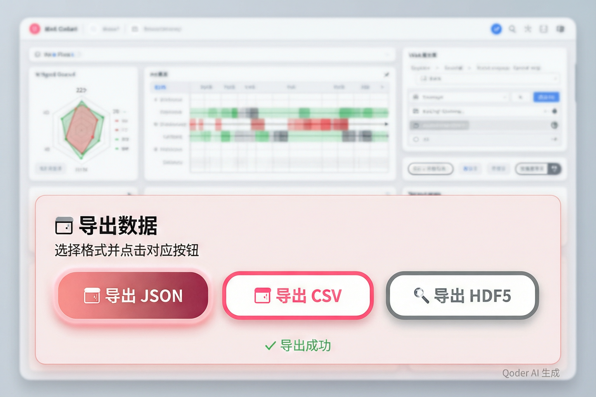

# TLabel v0.2.0b2 发布：UI 导出功能全面升级，一键导出 JSON/CSV/HDF5

> **摘要**：TLabel v0.2.0b2 正式发布！本次更新在 v0.2.0b1 的基础上，重磅推出**交互式面板底部三个醒目导出按钮**（JSON/CSV/HDF5），用户无需编写代码即可一键导出数据。同时保留 LeRobot 双向转换器、HDF5 科学格式、元数据增强等核心功能。本文将带你从零开始，5 分钟快速上手 TLabel 触觉数据标注流程。

---

## 一、什么是 TLabel？

如果你正在做**触觉感知研究**或**机器人灵巧操作**，可能会遇到这样的痛点：

- 不同品牌的触觉传感器（GelSight、DIGIT、PaXini、Daimon）输出格式完全不同
- 原始触觉数据是一堆看不懂的数字矩阵
- 手动逐帧标注数据效率极低，还容易出错
- 实验室之间数据格式不统一，合作困难

**TLabel** 就是为了解决这些问题而生的——它是一个**传感器无关的触觉数据标注工具包**，核心设计理念是：

```
load（加载任意传感器数据）→ review（可视化审查）→ export（导出统一格式）
```

无论你用的是哪种触觉传感器，TLabel 都能让它们"说同一种语言"。

---

## 二、v0.2.0b2 更新亮点

### 2.1 🎨 UI 导出功能全面升级（新增）

**最显著的改进**：交互式面板底部新增三个醒目的导出按钮，用户无需编写代码即可一键导出数据！



#### 💾 导出 JSON（主按钮）
- **样式**：渐变粉红色背景 (#e85d75 → #d1495b)，白色文字，带阴影效果
- **功能**：下载完整的 TLabel Format v2 JSON 文件
- **包含内容**：schema_version、feature_names（22 维特征名称）、sensor_id、calibration、frames（含 is_first/is_last 标记）
- **适用场景**：完整备份、与其他工具交换数据、保留所有元数据

#### 📊 导出 CSV（次要按钮）
- **样式**：白色背景 + 粗粉色边框，粉色文字
- **功能**：下载扁平表格格式的 CSV 文件
- **包含列**：frame_idx, timestamp_s, manipulation_phase, confidence, 以及 22 个特征字段
- **适用场景**：Excel 分析、pandas 数据处理、快速查看和分享

#### 🔬 导出 HDF5（第三按钮）
- **样式**：白色背景 + 灰色边框，灰色文字
- **功能**：点击后提示使用 Python API（浏览器无法直接创建 HDF5 文件）
- **正确用法**：在 Python 中执行 `data.export("output.hdf5")`
- **适用场景**：MATLAB/SciPy 科学计算、大规模数据集存储、科研标准格式

> 💡 **提示**：HDF5 格式由于浏览器安全限制，需要通过 Python API 导出。JSON 和 CSV 可以直接在面板中点击下载，非常方便！

### 2.2 元数据增强：与下游框架无缝对接

之前用户反馈最多的问题是："TLabel 导出的数据怎么和我的训练框架对接？"

这次我们新增了以下元数据字段：

| 字段 | 说明 | 用途 |
|------|------|------|
| `sensor_id` | 传感器唯一标识 | 多传感器实验时区分数据来源 |
| `calibration_params` | 标定参数 | 力值校准、温度补偿等 |
| `feature_names` | 22 维特征名称列表 | 下游框架自动识别字段含义 |
| `is_first` / `is_last` | Episode 边界标记 | 强化学习、时序建模必需 |

这些字段对于 **LeRobot**、**RLDS** 等主流机器人学习框架至关重要。

### 2.2 LeRobot 双向转换器

Hugging Face 的 LeRobot 是目前最流行的机器人学习数据格式之一。v0.2.0b1 新增了双向转换功能：

```python
from tlabel.converters import lerobot_to_tlabel, tlabel_to_lerobot

# LeRobot Parquet → TLabel（用于标注）
tlabel_data = lerobot_to_tlabel("path/to/lerobot_dataset")

# 标注完成后，转回 LeRobot 格式
tlabel_to_lerobot("annotated.json", "output/lerobot_dataset")
```

自动处理 `meta/info.json` 和 Parquet 文件，支持自定义触觉字段路径。

### 2.3 HDF5 导出：科研标准格式

对于习惯使用 MATLAB、SciPy 的研究人员，现在可以直接导出 HDF5 格式：

```python
data.export("episode_001.hdf5")
```

导出的 HDF5 文件包含：
- `timestamps`：时间戳数组
- `frame_indices`：帧索引
- `is_first` / `is_last`：Episode 边界
- `tactile_features`：22 维特征矩阵
- `metadata`：传感器 ID、标定参数、Schema 版本

可以用 `h5py` 直接读取：

```python
import h5py
with h5py.File("episode_001.hdf5") as f:
    features = f["tactile_features"][:]  # shape: (num_frames, 22)
    is_first = f["is_first"][:]
```

### 2.4 完整教程：三种传感器全覆盖

为每种支持的传感器编写了分步教程：

- **GelSight/DIGIT**（视觉型触觉传感器）：[tutorial-gelsight.md](tutorial-gelsight.md)
- **PaXini PXCap**（分布式力阵列）：[tutorial-paxini.md](tutorial-paxini.md)
- **Daimon DM-TacClaw**（多模态机器人）：[tutorial-daimon.md](tutorial-daimon.md)

每个教程包含：前置准备、数据加载、查看修正、导出、进阶技巧、常见问题。

### 2.5 错误提示优化

之前的错误信息太抽象，新手看不懂。现在：

```python
# 之前
ValueError: Unknown format

# 现在
ValueError: 无法识别文件格式: .xyz

支持的文件格式：
  • .pkl / .pickle  — GelSight Mini, DIGIT (视觉型触觉传感器)
  • .h5 / .hdf5     — PaXini PXCap (分布式力阵列)
  • .parquet        — Daimon DM-TacClaw (多模态机器人)
  • 目录             — Daimon LeRobot 格式 (含 info.json + parquet + videos)
```

缺少依赖时，直接给出 `pip install` 命令。

---

## 三、5 分钟快速上手

### 步骤 1：安装（30 秒）

```bash
pip install tlabel==0.2.0b1
```

核心包只有 numpy 一个依赖，安装只需几秒。如果需要处理特定传感器数据，安装对应的 extras：

```bash
# GelSight / DIGIT
pip install tlabel[gelsight]

# PaXini
pip install tlabel[paxini]

# Daimon
pip install tlabel[daimon]

# 我全都要
pip install tlabel[all]
```

### 步骤 2：试用内置 Demo（1 分钟）

无需任何传感器数据，打开 Python 终端或 Jupyter Notebook：

```python
import tlabel

# 加载内置的 GelSight demo 数据
data = tlabel.demo()

# 打开交互式标注面板
data.review()
```

会弹出一个彩色面板：


- **顶部时间线**：绿色=接触、红色=滑动、灰色=空闲
- **雷达图**：显示当前帧的 22 维特征
- **详情面板**：可以逐个修改数值
- **底部导出区**：三个醒目按钮，一键导出 JSON/CSV/HDF5

**试试这个**：点击时间线上的不同帧，观察雷达图的变化。找到标注错误的帧（比如 `contact=0` 但 `force_magnitude > 0`），然后在底部导出区点击"💾 导出 JSON"保存结果。

### 步骤 3：第一次修正（2 分钟）

发现标注错误的帧？一键修正：

```python
# 在面板中使用批量修正工具：
# 1. 在时间线上拖拽选择一段帧
# 2. 在修正面板中设置 contact=0
# 3. 点击"应用"——级联规则会自动清零 7 个关联字段

# 或者用代码批量修正
data.batch_patch(10, 20, "contact", 0)  # 第 10-20 帧：无接触
```

**级联规则**确保物理一致性：当 `contact=0` 时，自动清零 `force_magnitude`、`slip_event` 等字段，并将 `manipulation_phase` 重置为 `"idle"`。

### 步骤 4：导出标注结果（30 秒）

**方式一：使用面板导出按钮（推荐）**

在交互面板底部，有三个醒目的导出按钮：

- **💾 导出 JSON**（粉红色主按钮）：完整 TLabel Format v2 schema，包含元数据
- ** 导出 CSV**（粉色边框按钮）：扁平表格格式，适合 Excel/pandas 分析
- **🔬 导出 HDF5**（灰色边框按钮）：科研标准格式，点击后提示使用 Python API

直接点击对应按钮即可下载文件！

**方式二：使用 Python 代码**

```python
# 导出为 JSON（完整 TLabel Format v2 schema）
data.export("my_annotations.json")

# 或导出为 CSV，方便用 Excel/pandas 分析
data.export("my_annotations.csv")

# 或导出为 HDF5，适合科研计算
data.export("my_annotations.hdf5")
```

> 💡 **提示**：HDF5 格式由于浏览器限制，需要通过 Python API 导出。JSON 和 CSV 可以直接在面板中点击下载。

**完成！** 你已经走完了完整的标注流程：加载 → 审查 → 修正 → 导出。

---

## 四、加载真实传感器数据

### 4.1 GelSight / DIGIT

```python
# 安装依赖
pip install tlabel[gelsight]

# 加载 .pkl 文件（来自 gelsight-force-estimation 等工具）
data = tlabel.load("my_gelsight_episode.pkl")
data.review()
```

**背后发生了什么**：适配器从背景减除后的触觉图像中提取 22 维特征，包括力大小、滑动检测、光流、操作阶段推断等。

### 4.2 PaXini PXCap

```python
pip install tlabel[paxini]

# 加载 .h5 或 .hdf5 文件
data = tlabel.load("my_paxini_episode.h5")
data.review()
```

**背后发生了什么**：适配器从每个 taxel 区域读取 6D 力/扭矩向量，检测接触和滑动事件，映射到 20 维 TLabel 特征（力传感器没有光流）。

### 4.3 Daimon DM-TacClaw

```python
pip install tlabel[daimon]

# 从 LeRobot 风格的目录结构加载
data = tlabel.load("path/to/daimon_episode/")
data.review()
```

**目录要求**：
- `meta/info.json` — episode 元数据
- `data/chunk-*.parquet` — 观测数据（114 维状态向量）
- `videos/` — FFV1 编码的触觉视频文件（可选，缺失时优雅降级）

**背后发生了什么**：适配器解码 FFV1 视频帧，提取触觉特征（形变、接触面积、纹理），并与机器人状态数据融合。

---

## 五、UI 交互功能详解

v0.2.0b2 版本对交互面板进行了重大改进，特别是**导出功能**的可视化增强。这是与 v0.2.0b1 最大的区别！

### 5.1 底部导出区域（v0.2.0b2 新增）

在面板底部新增了一个独立的导出区域，包含三个醒目的按钮：


#### 💾 导出 JSON（主按钮）
- **样式**：渐变粉红色背景 (#e85d75 → #d1495b)，白色文字，带阴影
- **功能**：下载完整的 TLabel Format v2 JSON 文件
- **包含内容**：
  - `schema_version`：格式版本号
  - `feature_names`：22 维特征名称列表
  - `sensor_id`：传感器唯一标识
  - `calibration`：标定参数
  - `frames`：所有帧数据（含 is_first/is_last 标记）
- **适用场景**：完整备份、与其他工具交换数据

#### 📊 导出 CSV（次要按钮）
- **样式**：白色背景 + 粗粉色边框，粉色文字
- **功能**：下载扁平表格格式的 CSV 文件
- **包含列**：frame_idx, timestamp_s, manipulation_phase, confidence, 以及 22 个特征字段
- **适用场景**：Excel 分析、pandas 数据处理、快速查看

####  导出 HDF5（第三按钮）
- **样式**：白色背景 + 灰色边框，灰色文字
- **功能**：点击后弹出提示，告知需要使用 Python API
- **原因**：浏览器无法直接创建 HDF5 文件（需要 h5py 库）
- **正确用法**：在 Python 中执行 `data.export("output.hdf5")`
- **适用场景**：MATLAB/SciPy 科学计算、大规模数据集存储

### 5.2 导出状态反馈

点击导出按钮后，按钮下方会显示绿色成功消息（如 "✓ 导出成功"），3 秒后自动消失。如果导出失败，会显示红色错误消息。

### 5.3 其他 UI 特性

- **中英文切换**：右上角 "EN/中" 按钮一键切换界面语言
- **批量修正**：选择帧范围 + 字段 + 值，一键应用级联规则
- **撤销功能**：点击 ↩ 按钮撤销上一次修正操作
- **实时统计**：顶部显示帧数、时长、接触率、滑移率、已修正数量

---

## 六、与 LeRobot 框架对接

如果你的下游训练流程使用 Hugging Face LeRobot，可以这样转换：

### 6.1 LeRobot → TLabel（用于标注）

```python
from tlabel.converters import lerobot_to_tlabel

# 读取 LeRobot Parquet 数据集
tlabel_data = lerobot_to_tlabel(
    "path/to/lerobot_dataset",
    tactile_field="observation.tactile"  # 触觉字段路径
)

# 打开面板审查和修正
tlabel_data.review()

# 导出为 TLabel JSON
tlabel_data.export("annotated.json")
```

### 6.2 TLabel → LeRobot（用于训练）

```python
from tlabel.converters import tlabel_to_lerobot

# 将标注好的 TLabel JSON 转回 LeRobot 格式
tlabel_to_lerobot(
    "annotated.json",
    "output/lerobot_dataset",
    tactile_field="observation.tactile"
)
```

自动更新 `meta/info.json` 中的 schema 信息。

---

## 七、TLabel Format v2：22 维特征详解

### 静态特征（18 维）

| # | 字段 | 说明 |
|---|------|------|
| 1 | `contact` | 接触标志（0/1） |
| 2 | `deformation_magnitude` | 表面形变强度 |
| 3 | `force_magnitude` | 法向力大小 |
| 4 | `force_peak` | 窗口内峰值力 |
| 5 | `force_direction` | 力向量角度（°） |
| 6 | `slip_entropy` | 滑动检测不确定性 |
| 7 | `slip_event` | 滑动事件标志（0/1） |
| 8 | `texture_energy` | 表面纹理频率能量 |
| 9 | `edge_density` | 接触边缘像素比例 |
| 10 | `contact_area` | 接触区域面积比例 |
| 11 | `centroid_x` | 接触质心 x 位置 |
| 12 | `normal_field_magnitude` | 法向压力场强度 |
| 13 | `normal_field_variance` | 法向场空间方差 |
| 14 | `shear_field_magnitude` | 剪切应力强度 |
| 15 | `shear_field_direction` | 剪切方向角度（°） |
| 16 | `delta_force_normal` | 帧间 ΔF_normal |
| 17 | `delta_force_shear` | 帧间 ΔF_shear |
| 18 | `friction_cone_ratio` | 切向/法向力比值 |

### 时序特征（4 维，v0.2.0 新增）

| # | 字段 | 图像型 | 力型 | 说明 |
|---|------|:------:|:----:|------|
| 19 | `optical_flow_magnitude` | ✅ | — | 帧间运动幅度（Farneback） |
| 20 | `optical_flow_direction` | ✅ | — | 光流角度（°） |
| 21 | `temporal_deformation_rate` | ✅ | ✅ | 形变变化率 |
| 22 | `contact_transition` | ✅ | ✅ | 接触状态转移概率 |

> 力型传感器（如 PaXini）没有光学图像，因此只有 20 维（缺少光流相关字段）。

---

## 八、常见问题

### Q1: 导入时出现 `ImportError: No module named 'cv2'`

**解决**：运行 `pip install tlabel[gelsight]` 或 `pip install opencv-python`

### Q2: 导入时出现 `ImportError: No module named 'h5py'`

**解决**：运行 `pip install tlabel[paxini]` 或 `pip install h5py`

### Q3: 导入时出现 `ImportError: No module named 'pyarrow'`

**解决**：运行 `pip install tlabel[daimon]` 或 `pip install pyarrow`

### Q4: `ValueError: Unknown format`

**解决**：检查文件扩展名（.pkl、.h5、.hdf5、.parquet），或显式指定格式：
```python
data = tlabel.load("myfile.xyz", format="gelsight")
```

### Q5: 如何在命令行中批量处理多个 episode？

```python
import tlabel
import glob

for pkl_file in glob.glob("episodes/*.pkl"):
    data = tlabel.load(pkl_file)
    # 这里可以添加自动修正逻辑
    data.export(f"annotated/{pkl_file.stem}.json")
```

---

## 九、项目地址与资源

- **GitHub**: https://github.com/liesliy/tlabel
- **PyPI**: https://pypi.org/project/tlabel/
- **在线 Demo**: https://liesliy.github.io/tlabel/demo.html
- **中文文档**: https://github.com/liesliy/tlabel/blob/main/README_CN.md
- **完整教程**: https://github.com/liesliy/tlabel/tree/main/docs

---

## 十、结语

TLabel v0.2.0b1 是一个重要的里程碑版本，标志着项目从 alpha 探索阶段进入 beta 稳定阶段。本次更新重点解决了**下游兼容性**问题，让 TLabel 输出的数据能够无缝对接 LeRobot、RLDS 等主流训练框架。

如果你是触觉感知领域的新手，建议从 5 分钟快速上手开始；如果你已经在用旧版本，升级后可以体验 LeRobot 转换器和 HDF5 导出功能。

**欢迎 Star ⭐ 支持项目**，也欢迎在 GitHub Issues 中反馈问题或提出新功能建议！
